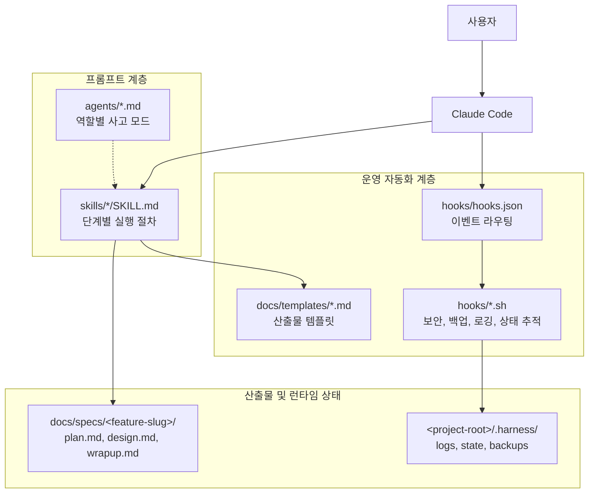
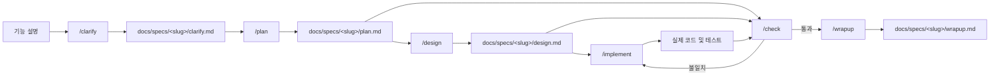
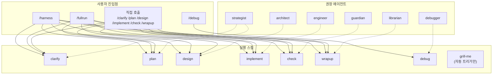
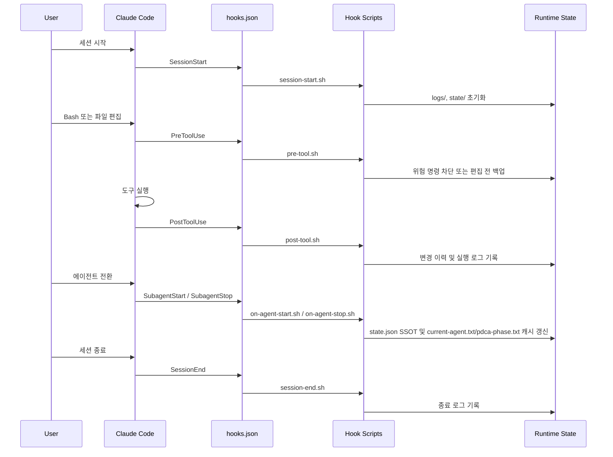

# 아키텍처

Harness Engineering은 Claude Code 위에서 동작하는 **워크플로우 플러그인**입니다. 실행 로직의 중심은 일반 애플리케이션 코드가 아니라, 다음 세 계층의 조합에 있습니다.

- **프롬프트 계층**: `skills/`, `agents/`
- **운영 자동화 계층**: `hooks/hooks.json`, `hooks/`
- **산출물/상태 계층**: `docs/specs/`, `<project-root>/.harness/`

## 0. 핵심 기능 (P0/P1)

### P0 Foundation

| 모듈 | 파일 | 설명 |
|------|------|------|
| **다중 프레임워크 테스트** | `hooks/lib/test-runner.sh` | Jest, Vitest, pytest, go test, cargo test 자동 감지/실행 |
| **검증 클래스** | `hooks/lib/verification-classes.sh` | Class A-D 검증 (정적분석 → E2E) |
| **서브에이전트 스포닝** | `hooks/lib/subagent-spawner.sh` | 독립 서브에이전트 스폰/관리/집계 |
| **상태 머신** | `hooks/lib/state-machine.sh` | PDCA 상태 추적, 스냅샷, 롤백 |

### P1 Enhancement

| 모듈 | 파일 | 설명 |
|------|------|------|
| **2단계 리뷰** | `hooks/lib/review-engine.sh` | 스펙 준수(60%) + 코드 품질(40%) |
| **스킬 평가** | `hooks/lib/skill-evaluation.sh` | 실행 메트릭 수집, 대시보드 생성 |
| **크래시 복구** | `hooks/lib/crash-recovery.sh` | Stuck 감지, 포렌식 리포트, 복구 옵션 |
| **브라우저 테스트** | `hooks/lib/browser-testing.sh` | Playwright/Cypress 통합 |

### P2 Advanced

| 모듈 | 파일 | 설명 |
|------|------|------|
| **해시 앵커 에디트** | `hooks/lib/hash-anchored-edit.sh` | 파일 해시 기반 충돌 방지, 무결성 검증 |
| **웨이브 실행** | `hooks/lib/wave-executor.sh` | 의존성 기반 병렬 실행, 순환 감지 |

## 1. 시스템 개요



### 해석

- 사용자는 Claude Code에 명령을 내리고, 실제 작업 절차는 `skills/`에 정의됩니다.
- `agents/`는 각 단계에서 어떤 관점으로 사고할지를 규정하는 **인지 모드**입니다.
- `hooks/`는 세션, 도구 실행, 에이전트 전환 시점에 개입해 상태 추적과 안전장치를 제공합니다.
- Git 저장소에서는 세션 시작 시 `.harness/`를 `.git/info/exclude`에 등록해 런타임 파일이 커밋 후보에 섞이지 않도록 합니다.

## 2. PDCA 실행 및 산출물 흐름



### 핵심 포인트

- `clarify.md`는 사용자 요청을 구체화한 문서로, Plan 단계의 입력이 됩니다.
- `plan.md`와 `design.md`가 이후 단계의 **고정 입력** 역할을 합니다.
- `implement` 단계는 실제 코드와 테스트를 변경하지만 별도 중간 산출물 문서는 만들지 않습니다.
- `check` 단계도 별도 문서를 생성하지 않고, 계획 대비 검증 후 필요 시 `implement`로 되돌립니다.

## 3. 진입점, 스킬, 에이전트 매핑



### 해석

- `/harness`는 단계별 진입점이고, `/fullrun`은 전체 PDCA 사이클 오케스트레이터입니다.
- `/grill-me`는 plan이나 design 같은 산출물에 대해 철저한 검증 질문을 수행합니다 (자동 트리거만, 명시적 호출 불가).
- 각 스킬은 특정 에이전트와 자연스럽게 짝을 이루지만, 구조적으로는 **느슨하게 결합**되어 있습니다.
- 이 설계 덕분에 개별 단계 실행과 전체 자동 실행을 모두 지원할 수 있습니다.

## 4. 훅 이벤트 라이프사이클



### 훅의 책임

- `session-start.sh`: 로그/상태 디렉토리 준비, Git 브랜치 감지, `state.json` 복구 또는 캐시 초기화
- `session-start.sh`: 필요 시 `.git/info/exclude`에 `.harness/` 등록
- `pre-tool.sh`: 위험 Bash 명령 차단, 파일 편집 전 백업
- `post-tool.sh`: 파일 변경 해시 기록, Bash 실행 로그 기록
- `on-agent-start.sh`: 에이전트와 PDCA 단계를 매핑해 `state.json`과 런타임 캐시를 동기화
- `on-agent-stop.sh`, `session-end.sh`: 세션 종료 흔적 정리

## 5. 저장소와 런타임 상태

| 위치 | 역할 |
|:-----|:-----|
| `agents/*.md` | 역할별 사고 방식과 출력 기대치 정의 |
| `skills/*/SKILL.md` | 사용자 명령별 실행 절차 정의 |
| `hooks/hooks.json` | Claude Code 이벤트와 훅 스크립트 연결 |
| `hooks/*.sh` | 보안, 백업, 로깅, 상태 추적 자동화 |
| `hooks/lib/*.sh` | 훅 라이브러리 모듈 |
| `docs/templates/*.md` | Plan, Design, Wrap-up 문서 골격 |
| `docs/specs/<feature-slug>/` | 기능별 SSOT 산출물 저장소 |
| `<project-root>/.harness/logs/` | 세션 로그, 보안 로그 |
| `<project-root>/.harness/state/` | 현재 PDCA 단계, 에이전트, 변경 이력 |
| `<project-root>/.harness/backups/` | 편집 전 백업 파일 |
| `<project-root>/.harness/engine/` | 상태 머신 엔진 데이터 |
| `<project-root>/.harness/metrics/` | 스킬 평가 메트릭 |
| `<project-root>/.harness/review/` | 2단계 리뷰 결과 |
| `<project-root>/.harness/recovery/` | 복구 체크포인트 |

## 6. 서브에이전트 실행 계약

`hooks/lib/subagent-spawner.sh`는 이제 서브에이전트 디렉터리 아래 산출물과 상태 전이를 명시적으로 관리합니다.

### 라이프사이클

`spawn` → `prepare` → `start` → `collect` → `finalize`

- `spawn`: `task.md`, `context.md`, `state.json` 생성, 상태는 `pending`
- `prepare`: `execution-request.json` 생성, 외부 실행기가 읽을 계약을 고정 경로로 제공, 상태는 `ready`
- `start`: 실제 실행 시작 시각 기록, 상태는 `running`
- `collect`: 외부 실행기 결과를 `adapter-result.json`, `collected-result.json`으로 정규화, 상태는 `collected`
- `finalize`: `result.md`와 필요 시 `failure.json` 작성, 상태는 `completed` / `failed` / `timeout`

### 산출물 경로

- `task.md`: 실행할 태스크 원문
- `context.md`: 프로젝트 컨텍스트와 출력 규약
- `execution-request.json`: 외부 실행기용 입력 계약
- `adapter-result.json`: 실행기가 남긴 원본 구조화 결과
- `collected-result.json`: 하네스가 정규화한 중간 결과
- `result.md`: 사람이 읽는 최종 결과
- `failure.json`: 실패 코드, 메시지, 세부 정보

### 실패 사유 형식

`failure.json`과 `state.json.error`는 같은 형식을 사용합니다.

```json
{
  "code": "short_machine_code",
  "message": "human readable summary",
  "details": {}
}
```

### 라이브러리 모듈 (hooks/lib/)

| 모듈 | 설명 | 의존성 |
|------|------|--------|
| `json-utils.sh` | JSON 파싱, jq 래퍼 | 없음 |
| `logging.sh` | 구조화된 로깅 | json-utils |
| `validation.sh` | 입력 검증 | json-utils |
| `error-messages.sh` | 사용자 친화적 에러 | logging |
| `context-rot.sh` | 컨텍스트 품질 추적 | json-utils |
| `automation-level.sh` | L0-L4 자동화 레벨 | 없음 |
| `feature-registry.sh` | Feature 메타데이터 관리 | json-utils |
| `cleanup.sh` | 리소스 정리 | 없음 |
| `feature-sync.sh` | Feature 동기화 | feature-registry |
| `skill-chain.sh` | 스킬 체인 실행 | 없음 |
| `result-summary.sh` | 결과 요약 | json-utils |
| `worktree.sh` | Git worktree 관리 | 없음 |
| `doctor.sh` | 시스템 진단 | logging |
| `test-detection.sh` | 프레임워크 감지, 패키지 매니저 판별, 명령 합성 | test-runner |
| `test-results.sh` | 테스트 결과 파싱, 성공률 계산, 요약 출력 | test-runner |
| **test-runner.sh** | 다중 프레임워크 테스트 facade, 실행/재시도/커버리지 (P0-1) | test-detection, test-results |
| **verification-classes.sh** | 검증 클래스 (P0-1) | test-runner |
| **subagent-spawner.sh** | 서브에이전트 스포닝 (P0-2) | json-utils, logging |
| **state-machine.sh** | 상태 머신 엔진 (P0-3) | json-utils, logging |
| `state-store.sh` | state.json / transitions.jsonl 읽기·쓰기 | state-machine |
| `phase-cache.sh` | current-agent/current-feature/pdca-phase 캐시 동기화 | state-machine, state-store |
| `snapshot-store.sh` | 스냅샷 생성·정리·복원 | state-machine, state-store |
| `subagent-request.sh` | task/context 준비, execution contract 생성, 시작 준비 | subagent-spawner |
| `subagent-collect.sh` | 실행 결과 정규화, 상태 조회, 집계, 대기 | subagent-spawner |
| `subagent-finalize.sh` | terminal 상태 기록, 결과 파일 작성, 정리 | subagent-spawner |
| `lsp-diagnostics.sh` | 언어별 진단 파서, 프로젝트 진단 요약, 리포트 렌더링 | lsp-tools |
| `lsp-symbols.sh` | 심볼 추출, 위치/rename edit 포맷 변환 | lsp-tools |
| `review-evidence.sh` | FR/file/API/config evidence 매칭, Stage 1 점수 입력 생성 | review-engine |
| **review-engine.sh** | 2단계 리뷰 orchestration, 결과 저장, helper fallback 제어 (P1-1) | review-evidence, subagent-spawner, state-machine |
| `skill-metrics.sh` | 스킬 실행 메트릭 기록, 통계 집계, export/cleanup | skill-evaluation |
| `skill-scoring.sh` | 스킬 점수 계산, 랭킹, 이상 탐지 | skill-evaluation, skill-metrics |
| `skill-report.sh` | 대시보드, 주간 리포트, 권장사항 생성 | skill-evaluation, skill-metrics |
| **skill-evaluation.sh** | 스킬 평가 facade, helper 로드/공개 API 유지 (P1-2) | skill-metrics, skill-scoring, skill-report |
| `crash-detection.sh` | stuck/loop 판정, 이슈 진단, 복구 옵션 계산 | crash-recovery |
| `crash-report.sh` | 크래시 분석, 포렌식 리포트, 옵션 목록 출력 | crash-recovery, crash-detection |
| **crash-recovery.sh** | 복구 facade, 상태 전환 실행, 체크포인트 생성 (P1-3) | crash-detection, crash-report, state-machine |
| `browser-state.sh` | browser session.json 경로/상태 초기화/조회 | browser-controller |
| `browser-session.sh` | Playwright 세션 연결/해제, Node bridge 실행 | browser-controller, browser-state |
| `browser-actions.sh` | 페이지 액션 래퍼, action.js 브리지, 입력 직렬화 | browser-controller, browser-session, browser-state |
| **browser-controller.sh** | 브라우저 facade, CLI, debug 출력 (P1-5) | browser-state, browser-session, browser-actions |
| `browser-test-runner.sh` | 브라우저 프레임워크 감지, 실행, 결과 파싱 | browser-testing |
| `browser-test-report.sh` | HTML 리포트, 히스토리 조회, 결과 정리 | browser-testing, browser-test-runner |
| **browser-testing.sh** | 브라우저 테스트 facade, 전체 suite orchestration (P1-4) | browser-test-runner, browser-test-report |
| **hash-anchored-edit.sh** | 해시 앵커 에디트 (P2-1) | json-utils, logging |
| **wave-graph.sh** | 웨이브 DAG 계산, 위상 정렬, 순환 감지 | jq |
| **wave-runner.sh** | 웨이브 실행 orchestration, subagent 집계 | wave-graph, subagent-spawner |
| **wave-executor.sh** | 웨이브 facade, task loading, YAML bridge | task-format, wave-graph, wave-runner |

## 6. 장기 런타임 경계

대형 Bash 모듈이 늘어나면서, 실행 계층은 다음 원칙으로 재정리합니다.

- **Bash는 control plane 유지**: 훅 진입점, 경로/파일 관리, 외부 프로세스 실행, fallback
- **보조 런타임은 pure data logic 담당**: DAG 계산, 점수화, JSON 정규화, 파서
- **첫 분해 대상은 `wave-executor.sh`**: 그래프 계산과 실행 orchestration을 분리했고, planner는 기본 `HARNESS_WAVE_PLANNER=auto`에서 Python helper를 우선 사용하되, 인프라 오류 시 Bash로 fallback합니다. 새 backend direct caller는 validate에서 차단합니다.
- **`review-engine.sh`는 1차 분해 완료**: Stage 1 evidence matcher는 `review-evidence.sh`, Stage 2 정규화/가중 점수 계산은 Python helper가 담당하고, Bash facade는 orchestration/fallback을 유지합니다.
- **`state-machine.sh`는 1차 분해 완료**: facade는 락/가드/전환만 유지하고, 상태 저장은 `state-store.sh`, 캐시 동기화는 `phase-cache.sh`, 스냅샷은 `snapshot-store.sh`로 분리했습니다.
- **`subagent-spawner.sh`도 1차 분해 완료**: facade는 공통 경로/유틸과 공개 함수명만 유지하고, 요청 준비는 `subagent-request.sh`, 결과 수집은 `subagent-collect.sh`, 완료 처리는 `subagent-finalize.sh`가 맡습니다.
- **`lsp-tools.sh`도 1차 분해 완료**: facade는 공개 LSP API를 유지하고, 진단 파싱은 `lsp-diagnostics.sh`, 심볼/위치 포맷 변환은 `lsp-symbols.sh`로 분리했습니다.
- **`skill-evaluation.sh`도 1차 분해 완료**: facade는 공개 API만 유지하고, 메트릭 기록/집계는 `skill-metrics.sh`, 점수/랭킹/이상 탐지는 `skill-scoring.sh`, 대시보드/권장사항 생성은 `skill-report.sh`로 분리했습니다.
- **`crash-recovery.sh`도 1차 분해 완료**: facade는 복구 실행/체크포인트 생성만 유지하고, stuck/loop 판정과 복구 옵션 계산은 `crash-detection.sh`, 분석/포렌식 리포트는 `crash-report.sh`로 분리했습니다.
- **`browser-controller.sh`도 1차 분해 완료**: facade는 CLI와 debug 출력만 유지하고, 상태 저장은 `browser-state.sh`, Playwright 세션 브리지는 `browser-session.sh`, 페이지 액션 래퍼는 `browser-actions.sh`로 분리했습니다.
- **`browser-testing.sh`도 1차 분해 완료**: facade는 전체 suite orchestration만 유지하고, 프레임워크 감지/실행/파서는 `browser-test-runner.sh`, HTML 리포트/히스토리/정리는 `browser-test-report.sh`로 분리했습니다.
- **`test-runner.sh`도 1차 분해 완료**: facade는 실행/재시도/커버리지만 유지하고, 프레임워크 감지/명령 합성은 `test-detection.sh`, 결과 파싱/요약은 `test-results.sh`로 분리했습니다.

자세한 분해 순서, 위험, 테스트 전략은 [runtime-redesign.md](runtime-redesign.md)에 정리되어 있습니다.

## 7. 설계 원칙

- **고정 경로 우선**: 스킬 간 인수인계는 검색보다 `docs/specs/<slug>/` 고정 경로를 사용합니다.
- **프롬프트 중심 오케스트레이션**: 복잡한 런타임 코드 대신 스킬과 에이전트 지침으로 작업 흐름을 제어합니다.
- **얕지만 실용적인 훅 자동화**: 보안 차단, 백업, 로깅, 상태 추적을 Bash 훅으로 가볍게 수행합니다.
- **문서와 실행 흔적 분리**: 기능 산출물은 `docs/specs/`, 런타임 로그와 백업은 `.harness/`에 분리해 보관합니다.
